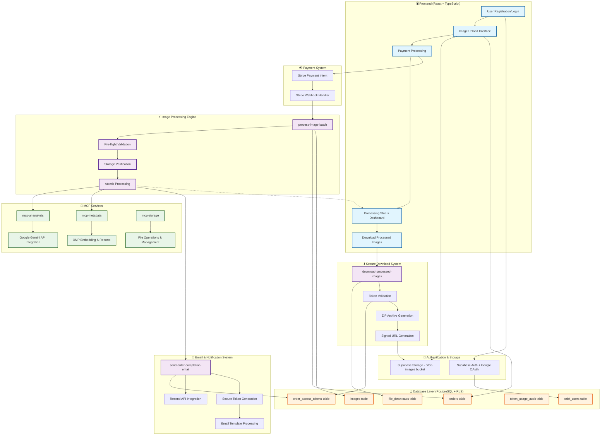

# ORBIT Image Forge

[](https://choosealicense.com/licenses/mit/)
[](https://reactjs.org/)
[](https://www.typescriptlang.org/)
[](https://supabase.com)
[](http://makeapullrequest.com)

## 🎯 Project Overview

**ORBIT Image Forge** is an open source AI-powered image processing platform that analyzes lifestyle and product images using Google Gemini AI, then embeds comprehensive metadata directly into image files using industry-standard XMP formats.

**🚀 Live Demo**: https://preview--orbit-image-forge.lovable.app  
  
**🤝 Contributing**: [Developer Guide](./CONTRIBUTING.md)

## 📊 System Architecture



## 🔄 Workflow Steps

### **Phase 1: User Onboarding & Upload**
1. **User Registration/Login** → Supabase Auth with Google OAuth
2. **Image Upload Interface** → Direct FormData upload to Supabase Storage
3. **Order Creation** → Database entry with unique order number
4. **Payment Processing** → Stripe integration with webhook validation

### **Phase 2: Image Processing**
5. **Payment Verification** → Triggers processing pipeline
6. **Pre-flight Validation** → Environment and dependency checks
7. **Storage Verification** → File existence and integrity validation
8. **Atomic Processing** → Individual image processing with rollback capability
9. **MCP Service Calls** → Direct calls to AI analysis and metadata services

### **Phase 3: AI Processing & Metadata Generation**
10. **Google Gemini Analysis** → Lifestyle/product image analysis via mcp-ai-analysis
11. **XMP Metadata Embedding** → ORBIT schema compliance via mcp-metadata
12. **Report Generation** → Human-readable analysis reports
13. **Thumbnail Creation** → Multiple sizes with web optimization
14. **Storage Organization** → Processed files in organized folder structure via mcp-storage

### **Phase 4: Completion & Delivery**
15. **Email Notification** → Automatic completion email with secure links
16. **Token Generation** → 7-day expiry, 10-use limit access tokens
17. **Download Interface** → Secure ZIP archive generation
18. **Audit Logging** → Complete usage tracking and security monitoring

### **Key Features**

- **🛡️ Security**: Dual authentication (user session + email tokens)
- **⚡ Performance**: Fast, reliable image processing
- **📊 Monitoring**: Complete audit trails and error handling
- **🔗 MCP Integration**: Modular service architecture

## 🏗️ Architecture Overview

### **Core Processing Engine** ⚡
- **Performance**: Fast, reliable image processing
- **Features**:
  - Storage verification checkpoints
  - Atomic processing with rollback
  - Enhanced error classification
  - Direct MCP service integration

### **MCP Service Architecture** 🔗
- **mcp-ai-analysis**: Google Gemini AI integration for image analysis
- **mcp-metadata**: XMP metadata embedding and report generation
- **mcp-storage**: File operations and storage management
- **Modular Design**: Independent, scalable service components

## 🚀 Key Features

### **AI-Powered Analysis**
- **Google Gemini Integration**: Advanced image analysis
- **Automatic Type Detection**: Lifestyle vs product analysis
- **Comprehensive Metadata**: Colors, objects, scenes, emotions, marketing insights

### **XMP Metadata Embedding**
- **ORBIT Schema Compliance**: Industry-standard metadata
- **Multiple Output Formats**: Processed images, standalone XMP, human-readable reports
- **Thumbnail Generation**: 3 sizes with web optimization

### **Secure Token-Based Access**
- **Email Notifications**: Automatic completion emails with secure links
- **Token Authentication**: 7-day expiry, 10-use limits
- **Audit Trail**: Complete usage tracking and security monitoring

### **Advanced Error Recovery**
- **Intelligent Retry Logic**: Context-aware error classification
- **Self-Healing System**: Automatic recovery and escalation
- **Comprehensive Logging**: Correlation IDs and detailed audit trails

## 🛠️ Technology Stack

### **Frontend**
- **Framework**: React 18 + TypeScript + Vite
- **UI Library**: Tailwind CSS + shadcn/ui components
- **State Management**: React hooks with custom management
- **Authentication**: Supabase Auth with Google OAuth

### **Backend**
- **Runtime**: Supabase Edge Functions (Deno)
- **Database**: PostgreSQL with comprehensive RLS
- **Storage**: Supabase Storage with organized bucket structure
- **AI Integration**: Google Gemini API
- **Payments**: Stripe integration

### **MCP Service Integration**
- **`mcp-ai-analysis`**: Google Gemini AI integration for image analysis
- **`mcp-metadata`**: XMP metadata embedding and report generation  
- **`mcp-storage`**: Storage operations and file management

## 📋 Quick Start

### **Prerequisites**
- Node.js & npm ([install with nvm](https://github.com/nvm-sh/nvm#installing-and-updating))
- Supabase CLI
- Git

### **Frontend Development**
```bash
# Clone the repository
git clone <YOUR_GIT_URL>
cd orbit-image-forge

# Install dependencies
npm install

# Start development server
npm run dev
```

### **Backend Development**  
```bash
# Start local Supabase stack
supabase start

# Deploy specific edge function
supabase functions deploy <function-name>

# Deploy all functions
supabase functions deploy

# View function logs
supabase functions logs <function-name>
```

### **Environment Configuration**
Required environment variables:
```bash
SUPABASE_URL=<your-project-url>
SUPABASE_SERVICE_ROLE_KEY=<your-service-key>
GOOGLE_API_KEY=<your-gemini-api-key>
RESEND_API_KEY=<your-email-service-key>
STRIPE_SECRET_KEY=<your-stripe-key>
```

## 🧪 Testing MCP Services

### **Test Image Processing**
```bash
curl -X POST "https://<your-project>.supabase.co/functions/v1/process-image-batch" \
  -H "Authorization: Bearer <service-key>" \
  -H "apikey: <service-key>" \
  -H "Content-Type: application/json" \
  -d '{"orderId": "<order-id>"}'
```

### **Run Comprehensive Tests**
```bash
# Interactive test runner (recommended)
./tests/run-tests.sh

# Test individual MCP components  
./tests/scripts/test-process-batch.sh <order-id>

# Run specific test suite
./tests/run-tests.sh <order-id> <test-type>
# test-type: mcp, email, health
```

## 📊 Performance Metrics

### **Processing Performance**
- **Processing Time**: 8-12 seconds average
- **Success Rate**: 95%+
- **Throughput**: Optimized for quality and reliability

## 🔧 Development Scripts

```bash
# Frontend Development
npm run dev          # Start development server
npm run build        # Production build
npm run lint         # Code quality check
npm run typecheck    # TypeScript validation

# Backend Development  
supabase start                              # Local development
supabase functions deploy <function>        # Deploy single function
supabase db reset                          # Reset with migrations
supabase gen types typescript --local      # Generate types

# Testing
./tests/run-tests.sh                      # Interactive test runner
./tests/scripts/test-process-batch.sh     # Component test
./trigger-email.sh <order-id>              # Manual email trigger
```

## 🔒 Security Features

- **Row Level Security**: Comprehensive RLS policies on all tables
- **Function Security**: `SET search_path = public` protection
- **Token Validation**: Cryptographically secure access tokens
- **Audit Logging**: Complete tracking of all operations
- **CORS Protection**: Proper headers and origin validation
- **Input Validation**: File type, size, and parameter sanitization

## 📈 Monitoring & Observability

- **Real-time Health Checks**: System component monitoring
- **Performance Metrics**: Response times, success rates, error patterns
- **Correlation IDs**: End-to-end request tracking
- **Security Audits**: Token usage and access pattern analysis

## 🚀 Deployment

### **Frontend Deployment**
Automatic deployment via Lovable.app on git push to main branch.

### **Backend Deployment**
```bash
# Deploy all functions
supabase functions deploy

# Deploy with configuration
supabase functions deploy --no-verify-jwt <webhook-function>

# Push database changes
supabase db push
```

## 📚 Documentation

- **[CLAUDE.md](./CLAUDE.md)**: Complete system documentation
- **[CLAUDE.local.md](./CLAUDE.local.md)**: Local development guide
- **[tests/README.md](./tests/README.md)**: Comprehensive testing guide
- **API Documentation**: Available in Supabase dashboard
- **Architecture Diagrams**: In workflow diagram above

## 🧪 Testing Organization

The project includes a comprehensive testing suite in the `tests/` directory:

```
tests/
├── README.md                    # Testing documentation
├── run-tests.sh                 # Interactive test runner
├── scripts/                     # All test scripts
├── data/                        # Test data and configurations
├── output/                      # Test results (gitignored)
└── supabase/                    # Supabase-specific tests
```

### **Key Testing Features**
- **Interactive Test Runner**: Easy-to-use menu system for all tests
- **Organized Test Scripts**: All tests moved to dedicated directory
- **Test Data Management**: Sample orders and configurations
- **Automated Gitignore**: Test outputs and sensitive data excluded
- **Comprehensive Coverage**: MCP services, email, health checks

## 🤝 Contributing

We welcome contributions from developers of all skill levels! ORBIT Image Forge is designed to be contributor-friendly with comprehensive documentation and testing infrastructure.

### Quick Start for Contributors

1. **Fork and Clone**
   ```bash
   git clone https://github.com/YOUR_USERNAME/orbit-image-forge.git
   cd orbit-image-forge
   ```

2. **Setup Development Environment**
   ```bash
   npm install
   cp .env.example .env
   # Edit .env with your configuration
   ```

3. **Start Development**
   ```bash
   npm run dev                    # Frontend
   supabase start                 # Backend (separate terminal)
   ```

4. **Run Tests**
   ```bash
   ./tests/run-tests.sh          # Interactive test runner
   ```

### Areas We Need Help With

- **🚀 Performance**: Optimize image processing pipeline
- **📱 Mobile UI**: Improve responsive design
- **🔧 Features**: New AI models, batch processing, analytics
- **📚 Documentation**: API docs, tutorials, examples
- **🧪 Testing**: Increase test coverage

### Development Resources

- **[Contributing Guide](./CONTRIBUTING.md)**: Detailed development setup
- **[Testing Guide](./tests/README.md)**: Comprehensive test documentation
- **[Architecture Overview](./CLAUDE.md)**: System design and components
- **[GitHub Issues](https://github.com/YOUR_USERNAME/orbit-image-forge/issues)**: Bug reports and feature requests

**New to open source?** Look for issues labeled `good-first-issue`!

## 📄 License

This project is licensed under the MIT License - see the [LICENSE](LICENSE) file for details.

## 🎉 Achievements

- ✅ **MCP Service Architecture**: Modular, scalable service components
- ✅ **Google Gemini Integration**: Advanced AI-powered image analysis
- ✅ **XMP Metadata Embedding**: Industry-standard metadata compliance
- ✅ **Secure Token System**: Comprehensive access control and audit trails
- ✅ **Production Ready**: Full security, monitoring, and error handling

---

**Built with ❤️ using React, Supabase, and MCP Architecture**